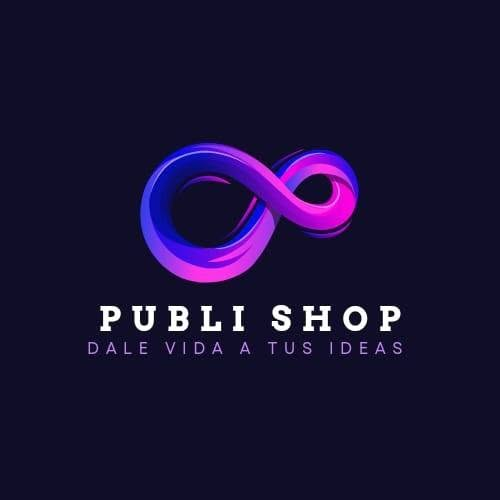

# PUBLI SHOP LEÓN GTO 🎨

**Sitio web profesional de PUBLI SHOP LEÓN GTO** — Especialistas en personalización y publicidad en León, Guanajuato.

> "Dale vida a tus ideas"



## 🌐 Ver sitio en vivo

El sitio está disponible en GitHub Pages:
**https://anibru300.github.io/Publishop**

## 📋 Descripción

PUBLI SHOP LEÓN GTO ofrece soluciones de personalización y presencia digital:

**Servicios principales:**
- 💻 Diseño de páginas webs profesionales
- 🔥 Grabado y corte láser en termos, plumas, MDF, cuero y más
- 👕 Sublimación en playeras, tazas, rompecabezas y artículos especiales

**Productos por categoría:**
- 🎨 Impresión DTF (playeras, textiles)
- ✂️ Corte de vinil (calcomanías, etiquetas, vasos, termos)
- 🪵 Corte y grabado en MDF (figuras, invitaciones, decoración)
- 📇 Papelería e impresión: tarjetas, flyers, stickers, invitaciones
- 🥤 Termos, tazas y plumas personalizadas
- 🏳️ Lonas publicitarias

## 🛠 Tecnologías utilizadas

- **HTML5** semántico y accesible
- **CSS3** con variables, flexbox, grid y animaciones
- **JavaScript vanilla** para interactividad
- **Font Awesome** para iconografía
- **Google Fonts** (Poppins + Montserrat)
- **GitHub Pages** para hosting gratuito

## 📁 Estructura del proyecto

```
publishop/
├── index.html              # Página principal
├── css/
│   └── styles.css          # Estilos del sitio
├── js/
│   └── main.js             # Interactividad
├── assets/
│   ├── images/
│   │   ├── logo.jpg
│   │   ├── servicios/      # Imágenes de los servicios principales
│   │   │   ├── paginas-web/
│   │   │   ├── laser/
│   │   │   └── sublimacion/
│   │   ├── productos/      # Galería de productos por categoría
│   │   │   ├── lonas/
│   │   │   ├── dtf/
│   │   │   ├── vinil/
│   │   │   ├── plumas/
│   │   │   ├── tazas/
│   │   │   ├── termos/
│   │   │   ├── mdf/
│   │   │   └── general/
│   │   └── facebook/       # Respaldo organizado de fotos de Facebook
│   │       ├── lonas/
│   │       ├── dtf/
│   │       ├── vinil/
│   │       ├── plumas/
│   │       ├── tazas/
│   │       ├── termos/
│   │       ├── mdf/
│   │       └── general/
│   └── videos/
│       └── hero.mp4        # Video de fondo del hero
├── README.md
└── .gitignore
```

## 📞 Contacto

- **WhatsApp:** [477 841 1655](https://wa.me/524778411655)
- **Teléfono:** 477 841 1655
- **Correo:** publi.shop.leongto@gmail.com
- **Ubicación:** San Mateo #206, Col. La Florida, León, Gto.
- **Facebook:** [PUBLI SHOP LEÓN GTO](https://www.facebook.com/profile.php?id=61561137908571)

## 🚀 Cómo ejecutar localmente

1. Clona el repositorio:
   ```bash
   git clone https://github.com/Anibru300/Publishop.git
   ```

2. Abre el archivo `index.html` en tu navegador favorito.

3. Opcional: usa un servidor local para una mejor experiencia:
   ```bash
   cd Publishop
   python -m http.server 8000
   ```
   Luego visita `http://localhost:8000`

## 📄 Licencia

© PUBLI SHOP LEÓN GTO. Todos los derechos reservados.

---

Hecho con ❤️ en León, Guanajuato.
